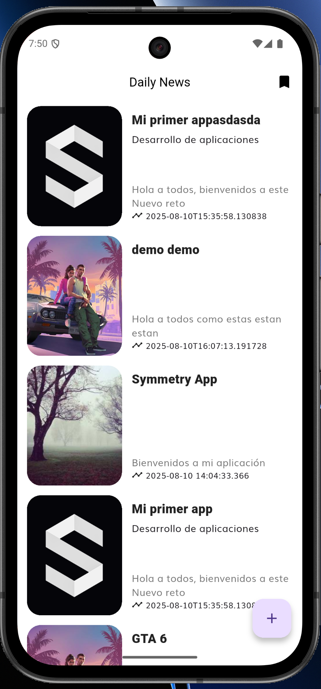
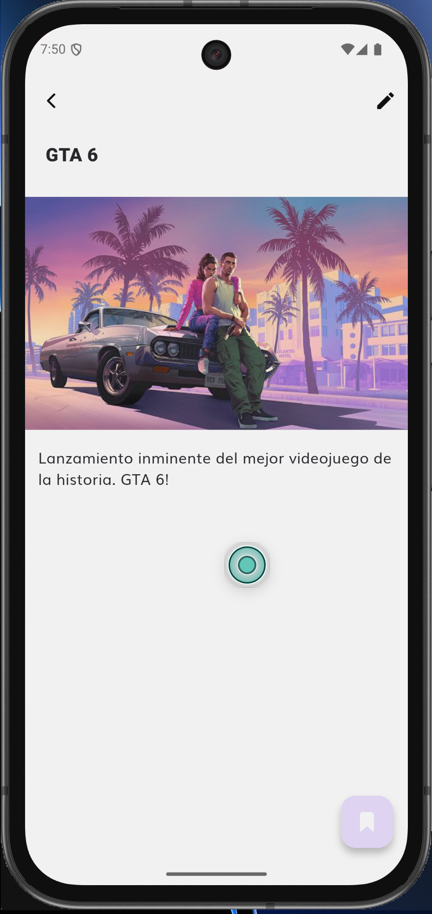
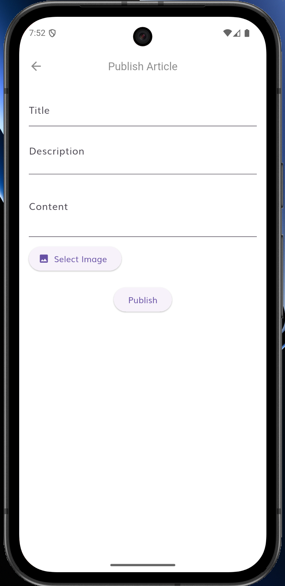
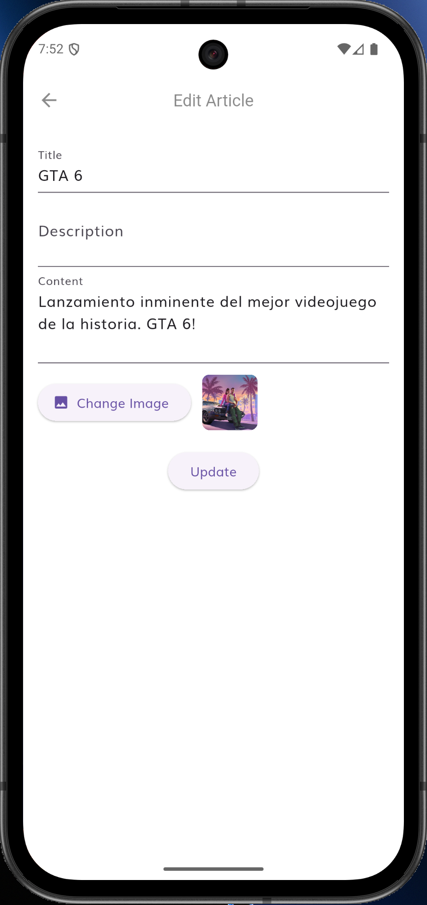

## 1. Introducción

Cuando empecé con esta prueba, la verdad es que tenía una mezcla de emoción y nervios. Ya había usado Flutter antes pero muy por encima nunca profundamente, pero nunca me había metido tan a fondo con Clean Architecture ni con Firebase a este nivel. Sabía que iba a ser un reto, pero también una buena oportunidad para aprender y crecer como desarrollador.

## 2. Mi camino de aprendizaje

En este proyecto aprendí muchísimo, sobre todo de cosas que antes solo había visto por encima. Me metí de lleno en tiempo record digamos con Clean Architecture para Flutter, Bloc para manejar el estado y toda la integración con Firebase (Firestore y Storage). Noté que la curva de aprendizaje fue empinada, pero logré entender lo básico para que pueda realizar esta prueba

La parte de permisos y Storage en móviles me hizo sudar, pero al final, leyendo foros y la doc oficial, logré que todo funcionara al menos superficialmente.

## 3. Retos y cómo los resolví

- **Librerias y proyecto:** Batallé un poco con la configuración inicial del proyecto y la integración de las librerías necesarias. Tuve que leer la documentación y hacer algunos ajustes en el archivo `pubspec.yaml` para que todo funcionara correctamente, porque la mayoria ya estaba obsoleto y como estaba usando la version de Flutter más reciente, todo se rompia y si me llevo algo de tiempo, pero aprendi tambien de las N cantidad de veces que lo hacia una y otra vez.
- **Plugins y permisos:** Me topé con varios errores usando image_picker y firebase_storage, sobre todo en Android. Tuve que ajustar permisos y actualizar dependencias hasta que todo corrió bien.
- **Refrescar la lista en tiempo real:** Quería que al publicar o editar un artículo, la lista se actualizara sola. Me costó un poco entender cómo manejar el estado y la navegación, pero con Bloc y algunos callbacks lo logré.
- **Editar sin duplicar:** Al principio, editar creaba un nuevo documento en Firestore. Tuve que modificar la arquitectura para soportar el docId y así distinguir entre crear y actualizar.
- **Imágenes:** Subir imágenes a Storage y mostrar previews (tanto locales como remotas) fue un reto técnico y de experiencia de usuario.

Cada problema fue una oportunidad para aprender a depurar, mejorar el código y entender por qué es tan importante una buena arquitectura.

## 4. Reflexión y futuro

Siento que este proyecto me hizo crecer mucho, no solo en lo técnico sino también en cómo organizarme y documentar lo que hago. Personalmente nunca habia usado Clean Architecture o aplicado esta arquitectura, por eso mismo estaba buscando oportunidades donde pueda tener esta experiencia en proyectos reales. Si tuviera que seguir mejorando la app, me gustaría:
- Agregar autenticación de usuarios.
- Meter tests unitarios y de integración.
- Mejorar la experiencia offline y el manejo de errores.
- Traducir la app a varios idiomas.

## 5. Prueba del proyecto

A continuación dejo algunas capturas y un video del resultado final:

### Lista de articulos


### Detalle de articulo


### Publicar articulo


### Editar articulo


### Video de demostración
Aquí puedes ver un video corto que muestra la aplicación en acción: [Video](screenshots/demo.mp4)

## 6. Overdelivery

### ¿Qué agregué extra?
- **Edición real de artículos:** Ahora puedes editar y se actualiza el mismo documento en Firestore, no se crea uno nuevo.
- **Subida de imágenes:** Puedes elegir una imagen de tu dispositivo y se guarda en Firebase Storage, mostrándose en la app.
- **Lista que se refresca sola:** Cada vez que publicas o editas, la lista se actualiza automáticamente.
- **Arquitectura limpia de verdad:** Todo separado en capas, usando Bloc y GetIt para que sea fácil de mantener y escalar.
- **Modifiqué un poco la UI para la creación de artículos:** Hice algunos ajustes en la interfaz para que sea más intuitiva al momento de crear un nuevo artículo.

### ¿Qué más se podría mejorar?
- Historial de cambios por artículo.
- Notificaciones push cuando hay nuevos artículos.
- Una versión web responsiva.
- Mejorar accesibilidad y soporte para varios idiomas.

## 7. Extra

- **Fragmento de código Bloc para edición:**
```dart
final isEdit = event.article.docId != null && event.article.docId!.isNotEmpty;
final result = isEdit
    ? await updateArticleUseCase(params: event.article)
    : await publishArticleUseCase(params: event.article);
```
